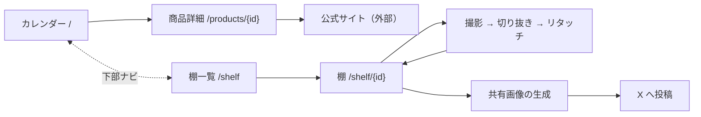

# web

発売カレンダーの画面と API。SvelteKit で書き、Cloudflare Workers 上で動く。

## 実行

```bash
pnpm dev      # ローカル起動。localhost:5173
pnpm build
pnpm deploy
```

`pnpm dev` に `--host` を付けている。
付けないと IPv6 だけで待ち受け、Dev Container のポート転送から届かない。

## 画面

| 画面 | URL | 内容 |
|---|---|---|
| カレンダー | `/` | 新作を発売月でグルーピング。メーカー・キーワード・価格で絞り込み、発売時期・価格でソートする。既定表示は今月と来月 |
| 商品詳細 | `/products/{id}` | 全何種、価格、ラインナップ、公式サイトへのリンク |
| 棚一覧 | `/shelf` | 自分の什器の一覧。作成もここから |
| 棚 | `/shelf/{id}` | 什器に写真を並べる。形の編集、撮影から切り抜き・リタッチまでのフローもこの画面の中 |
| 交換（フェーズ2） | `/trade` | 譲・求の登録とマッチ結果 |

導線。カレンダーと棚が2本柱で、下部ナビで行き来する。



## 表示の決まり

| 項目 | 扱い |
|---|---|
| 発売日 | メーカーが公開する粒度のまま。月・旬・週。日は表示しない |
| 発売月が不明 | 「発売月不明」として確定分と混ぜない |
| ラインナップ | 奇譚クラブの商品のみ表示される |
| 公式の商品画像 | 表示しない。写真はユーザー撮影のみ |
| 商品説明文 | 表示しない |

公式サイトへのリンクは必須。出典明示を兼ねるため省略しない。

## メーカーによる情報量の差

取得できる項目がメーカーごとに違う。

| 項目 | 奇譚クラブ | ターリン | タカラトミーアーツ | Qualia |
|---|---|---|---|---|
| 発売時期 | 旬まで | 15%欠損 | 週まで | 月まで |
| ラインナップ名 | 取れる | 取れない | 取れない | 取れない |

**欠落として見せない。** ラインナップ名がある商品を厚く見せ、無い商品は「全5種」で完結させる。
不足を強調すると、情報量の少ない商品が貧相に見える。

## 切り抜き

棚の写真の背景除去はブラウザ内で行う。`@imgly/background-removal`（ONNX Runtime WASM）を使う。

- モデルは `isnet_quint8`（42MB）。検証で品質・速度とも足りた。上位モデルとの差は所要時間に出ない
- 実行先は CPU。WebGPU は検証で差が出ず、対応も不揃いなため使わない
- 生の撮影画像を端末の外に出さない。R2 に上げるのは切り抜いた PNG だけ
- 初回はモデルのダウンロードが入る。進捗の表示を出す
- 撮影ガイドで品質を底上げし、失敗したら手動リタッチに逃がす

COOP/COEP ヘッダを全レスポンスに付けている。WASM をマルチスレッドで動かすため。
外部リソースを読み込むときは CORS 対応が要る。

スマホでの利用が主。モバイル表示を優先する。

## データの取得

画面用のデータは `+page.server.ts` の `load` で D1 から直接引く。
JSON を介さないため、画面と型がそのまま繋がる。

`/api/` は切らない。外部から叩く必要が出たときに作る。

商品説明文と画像は DB に無い。
扱うのは事実情報のみで、`official_url` を必ず含める。出典明示のため。

## D1 の扱い

server route から `platform.env.DB` で触れる。
接続文字列が無いため汎用の ORM は使えない。SQL は文字列で書く。

```ts
const { results } = await platform.env.DB
  .prepare('SELECT * FROM products WHERE maker_id = ?')
  .bind(makerId)
  .all();
```

行の型は各機能の `types.ts` に置き、queries と画面で共有する。

## 書き方

### Svelte

Svelte 5 の runes で書く。`$state` `$derived` `$props` を使う。
`export let` やストアの旧記法は使わない。vite 設定で runes モードを強制している。

### ディレクトリ

機能ごとにまとめる。横割り（components 全部・types 全部）にしない。

```text
src/
  routes/                     URL と機能の結び付けだけ。薄く保つ
    +page.server.ts           lib の queries を呼ぶ
    +page.svelte              lib の components を並べる
  lib/
    calendar/                 機能ディレクトリ。shelf、trade も同じ形
      components/             この機能のコンポーネント
      types.ts                この機能の型
      queries.server.ts       D1 への SQL。サーバ専用
    common/                   機能をまたぐもの
      components/             ヘッダーなど。ロジックは components の外に置く
```

`.server.ts` で終わるモジュールはサーバ専用になる。
クライアント側に import されるとビルドが落ちるため、SQL や秘匿値はこの名前に置く。

機能をまたいで使いたくなったものだけ `common/` へ出す。最初から共通化しない。

### 状態

絞り込みや検索の条件は URL のクエリパラメータに持たせる。
リロードや共有でそのまま再現でき、`load` がサーバ側で絞り込める。
コンポーネント内で閉じる状態だけ `$state` にする。

### スタイル

Tailwind のユーティリティで書く。独自の CSS はグローバルなものだけ `layout.css` に置く。

モバイル優先。プレフィックス無しをスマホ幅で書き、`sm:` 以上で広げる。

### デザイン

クレイモーフィズムとメンフィスの組み合わせ。
部品はぷっくりした樹脂の質感、背景と余白に幾何学の装飾。
書体は M PLUS Rounded 1c。丸ゴシックで質感と揃える。

**色はカラーテーマとして切り替えられる。** 色を直に書かず、必ずトークンを参照する。

- トークンは CSS 変数で `layout.css` に定義し、Tailwind のテーマから参照する
- `<html>` の `data-theme` で切り替える。選択は localStorage に保存する
- 既定は白。ピンク・黒などはトークン一式の追加だけで増やせる
- クレイの影は地色に依存するため、影の色もトークンに含める

| トークン | 既定値 | 用途 |
|---|---|---|
| 地色 | `#fcfaf7` | 画面の背景。真っ白にしない |
| 面色 | `#fffefd` | カードの面 |
| 墨色 | `#4a3d51` | 見出しと本文 |
| 淡墨 | `#a39588` | 補足の文字 |
| 主色 | `#f2766b` | コーラル。選択中・ボタン・ロゴの差し色 |
| 副色 | `#64bfae` | ミント。波線などの装飾 |
| 影色 | 地色を暗くした色 | クレイの影。ハイライトは面色から作る |

メーカーの識別色はテーマによらず固定。タグの地に使い、文字は白。

| メーカー | 色 |
|---|---|
| 奇譚クラブ | `#f2766b` |
| ターリン | `#64bfae` |
| タカラトミーアーツ | `#8a92e3` |
| Qualia | `#e8a94f` |

質感は 3 種の影で作る。Tailwind のテーマに定義して使い回す。

| 名前 | 用途 | 作り |
|---|---|---|
| `clay` | カード。角丸 26px | 外影 2 つ + 内側ハイライト + 内側下の陰 |
| `clay-sm` | チップ・小さいボタン | clay を弱めたもの |
| `clay-pressed` | 選択中のチップ | 主色の地に、内側の明暗 |

装飾は場所を決めて置く。散らさない。

- ヘッダの背景にドット柄
- 見出しの後ろに波線
- カードの隅に円と四角を交互に。透明度を下げて薄く

**棚は例外。** 写真が主役のため、装飾を置かず影も弱める。背景は無口に保つ。

### 型とコメント

`lang="ts"` を必ず付ける。`any` を使わない。
`src/lib/` の公開関数には TSDoc（`/** */`）で要約を書く。
コンポーネント内の処理には書かない。コメントの粒度は CLAUDE.md に従う。

### テスト

機能ごとの `__tests__/` に置く。ファイル名は対象 + `.test.ts`。

```text
src/lib/calendar/
  format.ts
  __tests__/
    format.test.ts
```

| 名前 | 対象 | 実行環境 |
|---|---|---|
| `*.test.ts` | ロジックとクエリ | node |
| `*.svelte.test.ts` | コンポーネント | ブラウザ |

**目で見て分からない壊れ方をするものを優先する。** 画面は開けば分かるが、境界値は見ても分からない。

- ロジックの境界値を1つずつ押さえる。価格帯の 300/301/499/500、月またぎの日時、LIKE の特殊文字
- クエリはモックせず、使い捨てのインメモリ SQLite に流して検証する。D1 は SQLite 互換のため挙動が一致する。本番・開発の DB には触れない
- モックするのは外部 HTTP・R2・時刻のような、遅いか再現できないものだけ
- ロジックはコンポーネントの外に出し、関数としてテストできる形に保つ
- コンポーネントのテストは操作のロジックを持つものだけに書く。表示だけのものは書かない
- 見た目はテストしない。スナップショットテストは使わない
- カバレッジの目標値は置かない

### 確認

区切りごとに次を通す。

```bash
pnpm check            # svelte-check。型エラーの検出
pnpm lint             # prettier + eslint
pnpm format           # 整形
pnpm test:unit --run  # テスト
```
